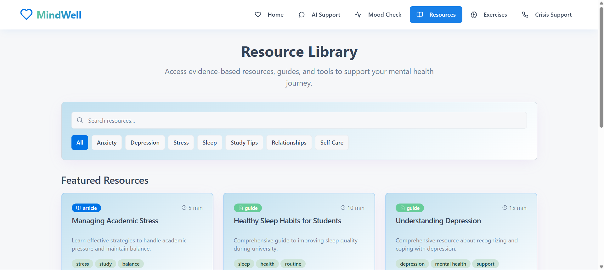
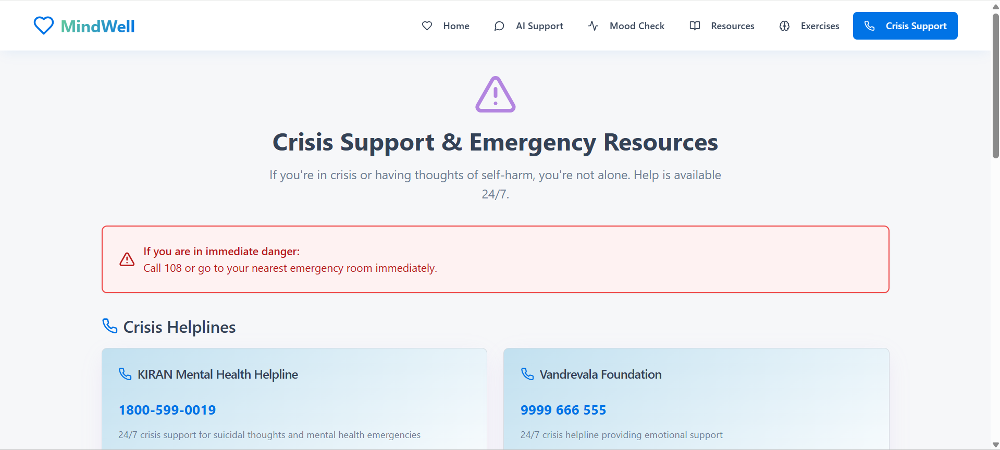

# 🧠 MindWell – Student Mental Health Support System

MindWell is a **frontend prototype of a student mental health support platform** designed to promote emotional wellbeing and provide accessible mental health resources for students.

The platform helps students monitor their emotional state, explore wellness resources, and access emergency support information through a **clean and user-friendly interface**.

This project was developed as a **UI prototype** demonstrating how digital tools can support student mental health awareness.

---

## 🚀 Live Demo

🔗 https://mindwell-student-support.netlify.app/

---

## 📸 Screenshots

### Homepage


---

### Mood Tracking Interface


---

### Wellness Resources


---

### Crisis Support


---

## 📌 Problem Statement

Students in higher education institutions frequently experience:

- Academic stress
- Anxiety and emotional pressure
- Lack of accessible mental health support
- Hesitation to seek help due to stigma

Many institutions do not provide **easy digital access to mental health resources**, leaving students without immediate guidance.

---

## 💡 Proposed Solution

MindWell is designed as a **digital support platform** that helps students become more aware of their emotional wellbeing.

The platform provides:

- Mood tracking interface for emotional reflection
- Curated mental health and wellness resources
- Crisis support and emergency contact information
- A responsive and accessible user interface

This prototype demonstrates how a **digital mental health support system for students** could function.

---

## ✨ Key Features

🧠 **Mood Tracking Interface (UI Prototype)**  
Allows students to reflect on and select their emotional state.

📚 **Wellness Resource Section**  
Provides mental health tips, articles, and support resources.

🚨 **Crisis Support Information**  
Displays emergency helplines and support resources.

📱 **Fully Responsive Design**  
Optimized for desktop, tablet, and mobile devices.

🎨 **Clean and Accessible UI**  
Designed for ease of use and readability.

---

## 🛠 Tech Stack

### Frontend
- React
- TypeScript
- Vite

### Styling
- Tailwind CSS

### Development Tools
- ESLint
- PostCSS

---

## 📂 Project Structure

```
mindwell-student-support/
│
├── public/
├── src/
│ ├── components/
│ ├── pages/
│ └── assets/
│
├── index.html
├── package.json
├── package-lock.json
├── tailwind.config.ts
├── vite.config.ts
├── tsconfig.json
└── README.md
```

---

## 🚀 Development Context

This project was developed during the **SIH 2K25 Internal Hackathon**.

**Problem Statement ID:** SIH25092  

**Title:**  
Development of a Digital Mental Health and Psychological Support System for Students in Higher Education

**Theme:**  
MedTech / BioTech / HealthTech

The project was created as a **frontend prototype demonstrating the user interface and concept of a digital mental health support system.**

---

## ▶️ Run Locally

### 1. Clone the repository

```
git clone https://github.com/salmashaik45/mindwell-student-support.git

cd mindwell-student-support
```

### 2. Install dependencies

```
npm install
```

### 3. Run development server

```
npm run dev
```

### 4. Build for production

```
npm run build
```

---

## 🎯 Future Improvements

- Backend integration for storing mood data
- Secure user authentication system
- Personalized wellness recommendations
- AI-based mental health chatbot
- Integration with university counseling services

---

## 👩‍💻 Author

**Salma Shaik**  
Computer Science and Engineering Student  

GitHub:  

https://github.com/salmashaik45

